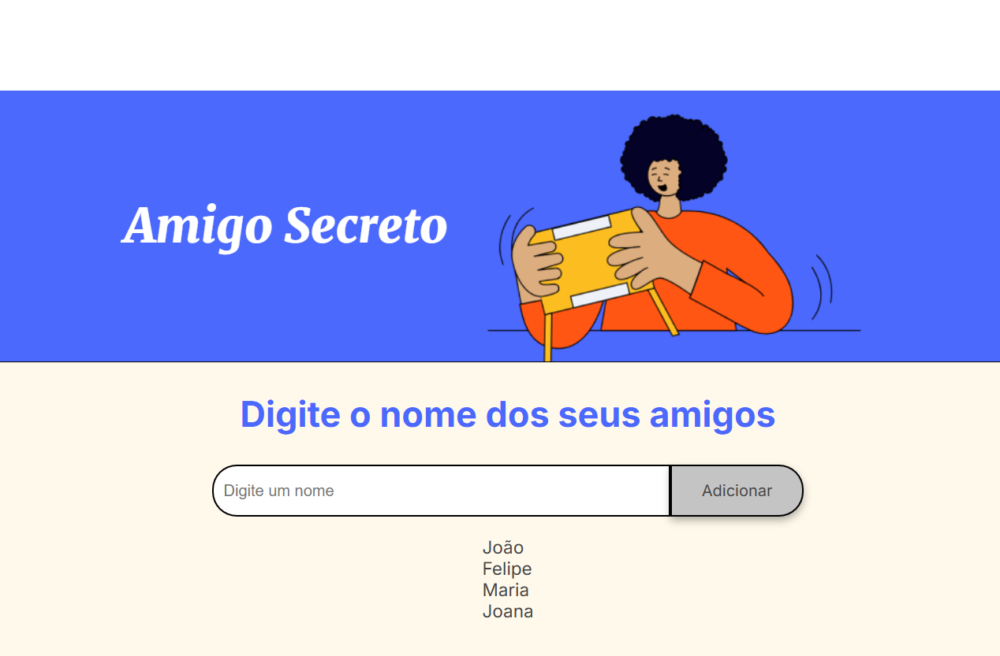

<h1 align="center" style="font-weight: bold;">Projeto Amigo Secreto</h1>

<p align="center">
 <a href="#about">📌 Sobre o projeto</a> • 
 <a href="#started">🚀 Como iniciar</a>
</p>

<p align="center">
    
</p>

<h2 id="about">📌 Sobre</h2>
O projeto Amigo Secreto é uma aplicação web simples para organizar o jogo de Amigo Secreto, permitindo que os participantes adicionem seus nomes e realizem o sorteio. As principais funcionalidades incluem:

- **Adicionar Nomes**: Permite que os usuários insiram os nomes dos participantes. Se o campo estiver vazio e o usuário clicar em "Adicionar", um alerta será exibido solicitando que um nome seja inserido.
- **Sortear Amigo Secreto**: Realiza o sorteio e exibe quem foi sorteado para cada participante. Se não houver amigos na lista e o usuário clicar em "Sortear amigo", um alerta será exibido informando que deve adicionar primeiro.

<h2 id="started">🚀 Como iniciar</h2>

<h3>Instalação</h3>
1. Clone o repositório:
   ```bash
   git clone https://github.com/NicolleMP/amigo-secreto.git
